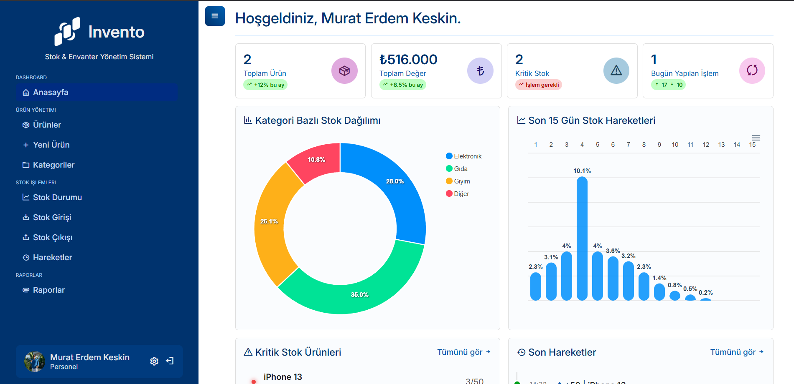
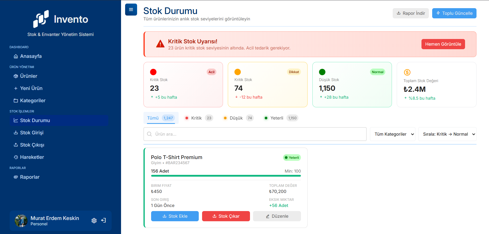
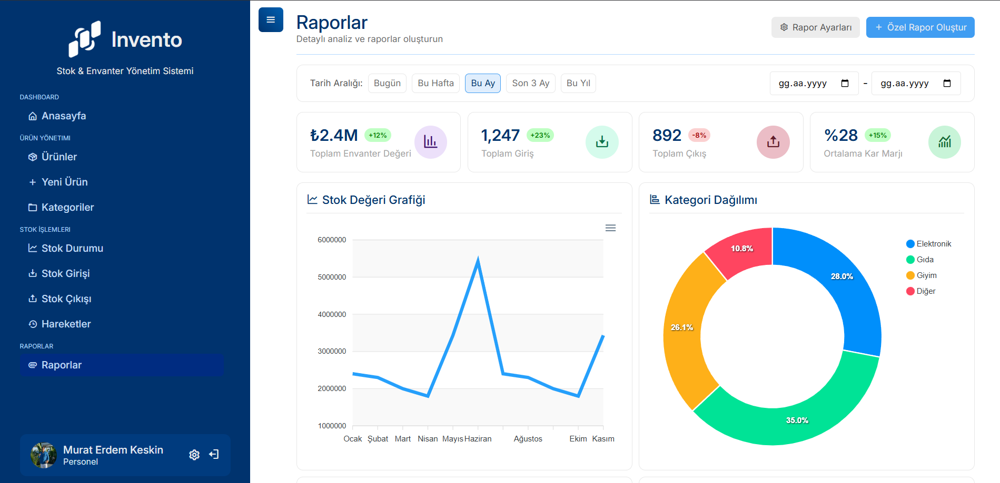

# 📦 Stok & Envanter Yönetim Sistemi

Node.js + Express + EJS kullanılarak geliştirilmiş, ürün/stok takibi, kritik stok uyarıları, grafik analizleri ve kategori yönetimi sunan **profesyonel** bir Stok & Envanter Yönetim Uygulaması.

> Gerçek işletmelerde kullanılabilecek düzeyde modüler ve ölçeklenebilir bir mimari ile tasarlanmıştır.

## 🚀 Özellikler

### 📁 Ürün Yönetimi
- Ürün ekleme, silme, güncelleme
- SKU, barkod, stok, fiyat, KDV vb. alanlar
- Detaylı ürün sayfası
- Ürün resmi yükleme

### 🏷️ Kategori Yönetimi
- Kategori oluşturma, düzenleme ve silme
- Kategori bazlı ürün listeleme

### ⚠️ Kritik Stok Uyarıları
- Belirlenen stok seviyesinin altındaki ürünlerin otomatik gösterimi
- Dashboard üzerinde dikkat çekici uyarı kartları

### 📊 Analiz & Raporlama
- Stok Devir Hızı grafiği
- Kategori stok dağılımı
- Aylık/haftalık veri analizleri

### 👤 Kullanıcı & Oturum Sistemi
- Session tabanlı güvenli login
- Rol bazlı erişim kontrolü (RBAC)
- Auth middleware ile route güvenliği

### 🔍 Listeleme & Filtreleme
- Sayfalama (Pagination)
- Ürün ve kategori bazlı arama
- Tablolarda dinamik filtreleme

### 🧩 Modüler EJS Component Yapısı
- Layout, partial ve component mimarisi
- Sidebar, navbar, kart, tablo gibi tekrar kullanılabilir (reusable) bileşenler

## 🛠 Teknolojiler

| Alan | Teknoloji |
|---|---|
| **Backend** | Node.js, Express.js |
| **Template Engine** | EJS |
| **Veritabanı** | MySQL / PostgreSQL |
| **Styling** | TailwindCSS / Vanilla CSS |
| **Grafikler** | ApexCharts / Chart.js |
| **Auth & Security** | Express-Session, BCrypt |

## 📸 Ekran Görüntüleri

| Dashboard | Ürün Listesi |
|---|---|
|  |  |

| Kritik Stok | Analiz Grafiği |
|---|---|
|  |  |

## 🔧 Kurulum

Projeyi yerel ortamınızda çalıştırmak için aşağıdaki adımları izleyin.

### 1️⃣ Depoyu Klonla
```bash
git clone [https://github.com/efecun-dev/stok-envanter-yonetim.git](https://github.com/efecun-dev/stok-envanter-yonetim.git)
cd stok-envanter-yonetim
```

### 2️⃣ Bağımlılıkları Yükle
```bash
npm install
```

### 3️⃣ .env Dosyası Oluştur
*Örnek dosyayı kopyalayarak .env dosyanızı oluşturun:*
```bash
cp .env.example .env
```
*.env içeriğini düzenleyin*
```properties
PORT=3000
SESSION_SECRET=oturum_anahtariniz
```

### 4️⃣ Veritabanını Kur

1. MySQL veya PostgreSQL üzerinde stok adında bir veritabanı oluşturun.
2. /config klasöründeki SQL dosyasını veya şemayı içeri aktarın.

### 5️⃣ Uygulamayı Başlat
```bash
npm run dev
```
Tarayıcıda **http://localhost:3000** adresine gidin

### 6️⃣ Proje Yapısı (Folder Structure)
Dosya düzeninin ne kadar temiz olduğunu gösteren o meşhur ağaç yapısı.

## 📂 Proje Yapısı

```text
📦 stok-envanter-yonetim
├── components/       # Yeniden kullanılabilir mantıksal bileşenler
├── config/           # Veritabanı ve genel ayarlar
├── controllers/      # Route işleyicileri (Business Logic)
├── middlewares/      # Auth ve validasyon ara katmanları
├── models/           # Veritabanı modelleri
├── public/           # Statik dosyalar
│   ├── css/
│   ├── js/
│   └── img/
├── routes/           # Endpoint tanımları
├── utils/            # Yardımcı fonksiyonlar
├── views/            # EJS şablonları
├── server.js         # Uygulama giriş noktası
└── package.json
```

### 7️⃣ Güvenlik, TODO ve Lisans
Son vuruşlar. Gelecek planların ve güvenlik önlemlerin.

## 🛡 Güvenlik

- **BCrypt:** Kullanıcı parolaları veritabanında hashlenerek saklanır.
- **Session Auth:** Güvenli oturum yönetimi.
- **Role Based Access:** Yetkisiz kullanıcıların admin sayfalarına erişimi engellenir.
- **SQL Injection Koruması:** Parametreli sorgular veya ORM kullanımı.

## 🧩 TODO

- [ ] REST API endpointleri geliştirilecek
- [x] Ürün resmi yüklemede Drag & Drop desteği
- [x] Detaylı stok giriş–çıkış hareketleri (Log)
- [ ] Audit Log (Kim ne zaman ne yaptı?)
- [ ] Docker konteyner desteği
- [ ] Dark Mode UI seçeneği

## 📄 Lisans

Bu proje [MIT Lisansı](LICENSE) ile yayınlanmıştır.


